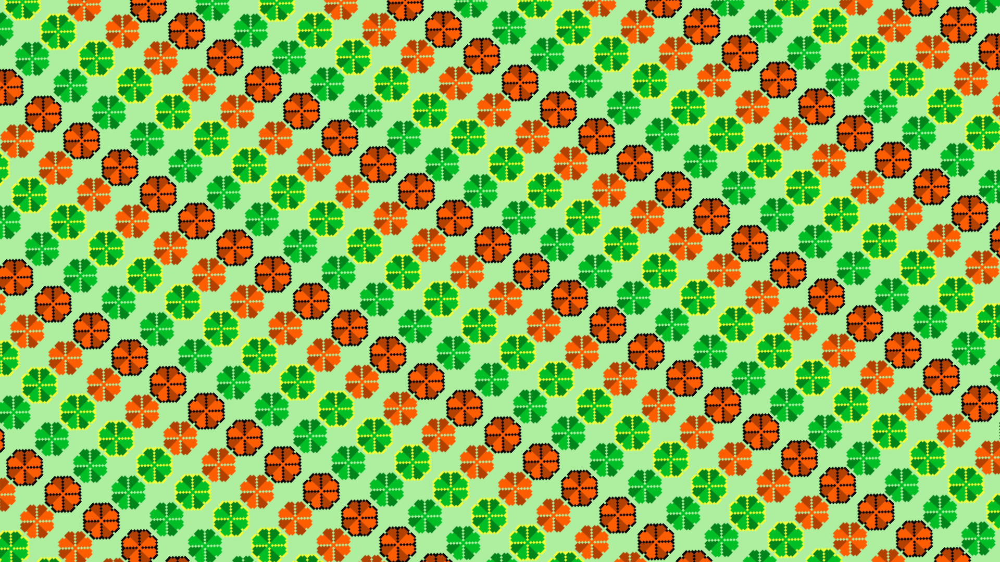
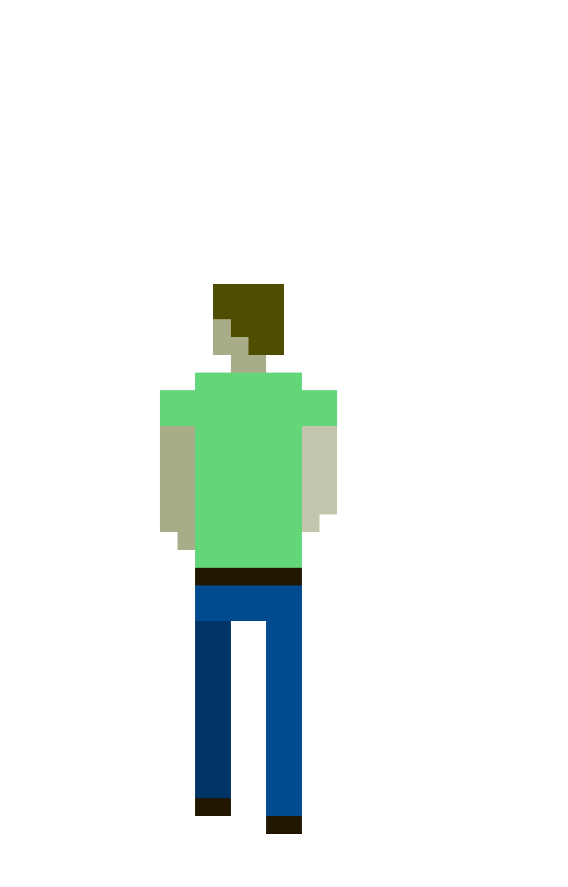
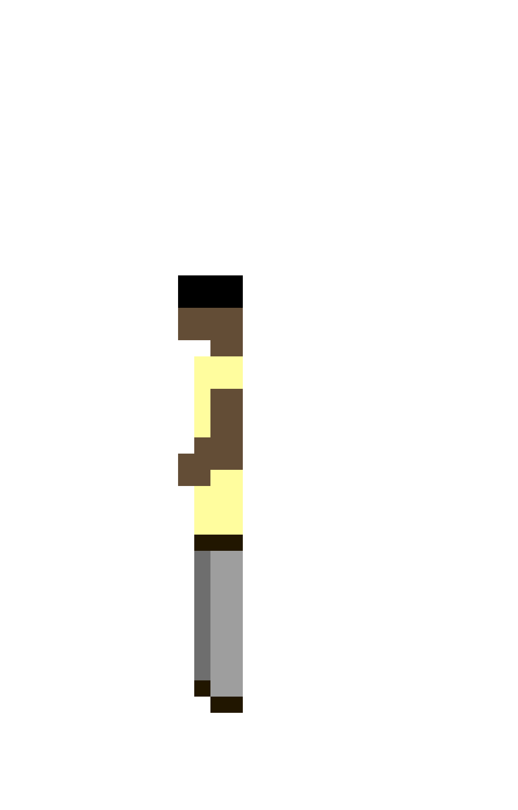

# I Just Need To Get To Work  
*Puzzle game made for the Brackeys Game Jam 2025.1*

## History  
You play as a completely regular guy. He is, in fact, so regular that he doesn’t even have a name. So... let’s call him **Bob** for now.  
Bob needs to get to work. Like any other regular guy.  
However, the day before he somehow pissed off an elder god of luck.  
Now… everything he does can go wrong in a *really* bad way.  
But not everything is lost. Luck comes in waves, and even divine entities can’t alter the laws of balance and equivalent exchange.  
  
In short: Bob just wants to make it to work. And you’re the only one who can help.  
Good luck :)

## Gameplay  
- You control Bob by using the mouse.  
- Move him around his home and interact with objects when prompted (YES to interact / NO to decline).  
- Bob has two core meters: **Health** and **Luck**.  
  - If the Health meter reaches zero Bob dies.
  - The Luck meter shows how high your chances are for a positive or a negative outcome.  
    - 4 green clovers (max) → 80 % chance of success  
    - 1 green clover (min) → only 20 % chance of success  
- Manage Bob’s Health *and* Luck while you:  
  1. Take a bath  
  2. Get dressed  
  3. Go to work  
- Choose wisely. Only the right actions at the right times and, of course, a little luck, will get Bob to work.  
- You can unlock multiple endings depending on how well you prepare yourself to work.

## Built With  
- Godot (engine)  
- Pixel‑art assets (drawn by me)  
- Exported as HTML5 to itch.io

## Download & Play  
Visit the [itch.io page](https://noend-studios.itch.io/i-just-need-to-get-to-work) to play the game free via HTML5.  
(*Link will open in your browser — no installation required.*)

## 🖼️ Gallery  
| | | |
|---------------|---------------|---------------|
|  |  |  |

| |
|---------------|
|  |

| | |
|---------------|---------------|
|  |  |


## Repository Structure  
```
/assets      – art, sound, and other media files  
/scenes      – Godot scene files  
/scripts     – GDScript code  
project.godot  
.gitignore  
.gitattributes  
export_presets.cfg
```

## Future Updates  
This is the final version of the game. I don't plan on making anymore changes to it.

## Developer Notes & Tips  
- If you clone this repo and want to make modifications, open `project.godot` in Godot and ensure your engine version matches (or is compatible) with the one used in development.  
- Be mindful of the Luck system—it is intentionally fragile and somewhat random. It’s part of the design to reflect “everything going wrong” after messing with an elder god.  
- Feel free to fork, experiment, or build your own version. Asset credits appreciated if you use them.

## Acknowledgements  
Big thanks to the Brackeys Game Jam 2025.1 for the theme and community.  
> Thanks to everyone who has played and read this far.
  
---

*Created by noend studios*
